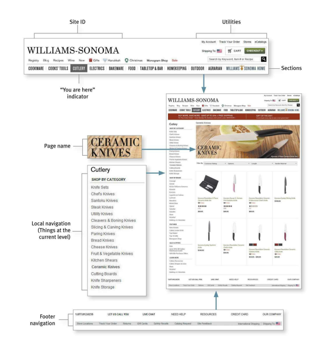
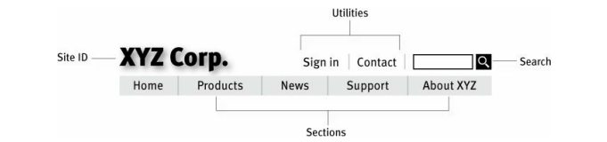

**Don't Make me Think Revisited A Common Sense Approach to Web and Mobile Usability** by _Steve Krug_ (2014, 3rd edition).

_Usability_ - A person of average (or even below average) ability and experience can figure out how to use the thing to accomplish something without it begin more trouble that it's worth.

## Ch-1 Don't make me think

You want the users to have these thoughts

-   Ok. This looks like the product categories...
-   Laptops, Memeory... There it is: Monitors Click
-   ...and these are today's special deals.

Things that make the users think and stop

-   Names (generally the cute and clever ones), marketing-induced names, company-specific names, and unfamiliar technical names. You should aim your names to be more "Obvious".
-   Links and buttons that aren't obviously clickable. Users should not have to spend time to figure out if things are clickable.
-   Where am I?
-   Where should I begin?
-   Where did they put \_\_\_?
-   What are the most important things on this page?
-   Why did they call it that?
-   Is that an ad or part of the site?
-   Those two links seem like they're the same thing. Are they really?

## Ch-2 How we really use the Web

We think people would use our site as

-   Look at each page.
-   Read all of the carefully crafted text.
-   Figure out how we've organized things.
-   Weight their options before deciding which link to click.

What people actually do

-   Glance at each new page.
-   Scan some of the text.
-   Click on the first link that catches their interest or vaguely resembles the think they're looking for.
-   Often large parts of the page are ignored.

This can be summarized by these facts

-   We don't read pages. We scan them. - People are on a mission to get something done and keep moving. They don't want to stop and read more than necessary.
-   We don't make optimal choices. We satisfice. - As soon as we find a link that seems like it might lead to what we're looking for, we will probably click it.
-   We don't figure out how things work. We muddle through.

## Ch-3 Billboard Design 101

Tips to make sure users see and understand as much of what they need to know - and of what you want them to know - as possible.

-   Follow existing conventions. Like logos should be top-left, navigation in top or left side. Search icon, video icon have standardized appearance.
-   Be consistent. For example, if navigation is always in the same place, then user's don't have to waste time looking for it.
-   Create effective visual hierarchies. Like use visual cues to to highlight things that are most important, which things are similar.
    -   The more important something is, the more prominent it is (larger, bolder, in a distinctive color, more white space, nearer the top of the page).
    -   For logically related things, group them together under a heading, display them in the same visual style.
    -   Nest things to show what's part of what.
-   Break up pages into clearly defined areas (this helps users decide which areas to focus on and which to ignore). People need to figure out these things on their own
    -   Things I can do on this site
    -   Links to today's top stories
    -   Products the company sells
    -   Things they're eager to sell me
    -   Navigation to get to the rest of the site
-   Make if abvious what's clickable. Use the same color for all text links, or make sure their shape and location identify as clickable.
-   Keep the visual noise to a minimum.
    -   Shouting. When everything on the page is clamoring for your attention. Lots of invitations to buy, lots of exclamation points, different typefaces, and bright colors, automated slideshows, animation, pop-ups. Solution is to organize pages, into visual hierarchies.
    -   Disorganization. Like things are not properly aligned.
    -   Clutter. For example, home pages that have too mich stuff that result in low signal-to-noise ratio i.e. lots of noise and not much information. When editing pages assume everything is visual noise and get rid of anything that is not making a real contribution.
-   Format text to support scanning.
    -   Use plenty of headings. Help to decide which parts to read, scan, or skip. Make higer level headings larger, or leave more space above them.
    -   Make the headings closer to the section they introduce than to the section they follow (i.e. the margin between the section below should be smaller than the section above).
    -   Keep paragraphs short. Generally, each paragraph should have a top sentence, detail sentence, and a conclusion. But on the web, you can even have single-sentence paragraphs.
    -   Use bulleted list. Almost anything that can be a bulleted list probably should be (items separated by commas or semicolons in a paragraph are good condadidates for this). And the list items should have a small amount of additional space between them.
    -   Highlight key terms. Format the most important ones in bold where they first appear in the text to make them easier to find, and don't highlight too much.

## Ch-4 Animal, Vegetable, or Mineral?

How many clicks to do something on the site?

-   People use hard limits like two or three, meaning it should not take more than these number of click to get to any page in the site.
-   Another metric, which the author suggests is to check how hard each click it (while still keeping the max click limit in mind) i.e. the amount of though required and the amount of uncertainity about whether I'm making the right choice.
-   Three mindless unambigous clicks equal one click that requires thought.

There are occasions when you can't avoid a difficult choice. In that scenario, you need to go out of your way to give the user as much guidance as I need - but no more.

-   Brief: Smallest amount of information that will help me
-   Timely: Placed so I encounter it exactly when I need it
-   Unavoidable - Formatted in a way that ensures that I will notice it.

## Ch-5 Omit needless words

Get rid of half the words on each page, then get rid of half of what's left (it means try to be ruthless about the process)

-   Happy talk must die. The introductory text that's supposed to welcome us to the site and tell us how great it is or tell us what we're about to see in the section we've entered.
-   Instructions must die. No one reads instructions until they have failed multiple times, and even then if the instructions are wordly, the odds of users finding the information they need are pretty low. Make everything self-explanatory, or as close to it as possible.
    An example of consise instruction is

    > Please help us improve the site by taking 2-3 minutes to complete the survey.
    >
    > NOTE: If you have comments or concerns that require a response, don't use this form. Instead, please contact Customer Service.

## Ch-6 Street signs and Breadcrumbs

Two types of users

-   Search dominant - will look for search bar as sson as they enter a site.
-   Link dominant - will browse first, searching only when they've run out of likely links to click or when they have gotten sufficiently frustated by the site.
-   Also, the current frame of mind, how much of a hurry they're in, and whether the site appears to have decent browsable navigation affects this decision also.

Problems with web browsing

-   No sense of scale. It is hard to know how many pages does the website have, which means it's hard to know whether you've seen everything of interest to you in a site, which means it's hard to know when to stop.
    To mitigate this issue, change the color of visited links.

-   No sense of direction.
-   No sense of location.
    This is why the home page is important, as it acts a starting point, and if you are inside a website, going to the homepage acts as a fresh start. And the same goes for the back button.

Purpose of navigation

-   Help us find whatever it is we're looking for.
-   Tell use where we are.
-   It tells us what's here. By making the hierarchy visible, navigation tells us what the site contains.
-   It tells us how to use the site. It tell you implicitly where to begin and what your options are (done correctly this is all the instruction you need).
-   It gives us confidence in the people who build it.

The general navigation convention for the web is

Persistent navigation (or global navigation) are navigation elements that appear on every page of a site. This helps the user get confirmation that they are on the same site. Some parts of the navigation might change a little depending on where you are, but it will always be at the same location and will work the same way.

-   Site ID - same as brand logo or sign outside a store, with distinctive typeface and a graphic that's recognizable at any size from a button to a billboard.
-   Sections (primary navigation) - links to the main sections of the site. Including a Home button here is also useful, as it gives even more visual assurance that you can reset if you get lost.

    -   When you hover over a section, subsections can also be shown for that section.

-   Utilities - links to important elements of the site that are not part of the content hierarchy (like Sign In/Register, Help, a Site Map, Shoppint Cart, info about publisher like About us, Contact Us).

    These should be slightly less prominent that the Sections.

-   Search. Every page must include this, as a mojarity of the people are looking for this. Keep is simple as shown in the diagram and use the word "Search". Do not get fancy with Find, Quick Find, Quick Search, or Keyword Search. You do not have to add the text "Type a keyword", as you can assume people using the web already know this stuff.

    Sometimes you might want to limit the search to the current page, section, or something. The author finds this practice rarely useful, as then you have to provide the users with options to choose the scope of the search or explain to them what the search is going to do, which takes a mental load on the users.

    A better approach is to use a global search and after the user is on the search page and is overwhelmed, then show them the options to limit the scope of the search.

An exception to the above rule is pages with "forms". When a person is filling in a form, we want to avoid unncessary distractions (like if you are paying on an e-comeerce site, you don't really want me to do anything but finish filling in the forms, and the same forregistering, subscribing, giving feedback, or checking off personalization preferences).

On these pages use a minimal version of persistent navigation with just the Site ID, a link to Home, and any utilities that might help me fill out the form.

Multi level navigation - Not much attention is given to lower-level. This happens partly because multi-level navigation is hard to design - given the limited amount of space on the page and the number of elements that have to be squeezed in.

Page names - These are the street signs of the web. When a user senses they are not headed in the right direction, they need to be able to spot the page name effortlessly.

-   Every page needs a name. Highlighting the page name in navigation is not enough.
-   The name needs to be in the right place in the visual hierarchy. It should frame the content that is unique to the page (not the navigation or the ads, which are just the infrastructure).
-   The name of the page should match the words the user clicked to get there. They should match as closely as possible and the reason for the difference should be obvious. For example, if I click "Gifts for Him" and the page is titled "Gifts for Men", then this is fine, as you are not going to think about the difference.

You are here - On maps these are the markers that let you know where you are. On the web, you need to highlight the current location in nav bar, lists or menus that appear on the page. Like

-   Put a pointer next to it.
-   Change the text color.
-   Use bold text.
-   Reverse/Change the button color.

Make sure that they stand out, because if they don't then they loose their value as visual cues and act as noise. Do not use subtle clues, as people are in a hurry.

Breadcrumbs - Show you where you are. Show you the path from home page to where you are and make it easy to move back up to higher levels in the hierarchy of a site.

-   Put them at the top.
-   Use `>` between levels. From trial and error this works best, as it visually suggests forward motion down through the levels.
-   Boldface the last item.

How to know you have accomplished all the above goals? Perform this test

1. Choose a page anywhere in the site at random, and print it.
2. Hold it at arm's length or squint so you can't really study it closely.
3. As quickly as possible, try to find and circle each of these items
    - Site ID
    - Page name
    - Sections (Primary naviagtion)
    - Local navigation
    - "You are here" indicator(s)
    - Search

The test is important, because more often than not we are put in the middle of the website through outside links and we have never seen the site's navigation scheme before.

## Ch-7 The Big Bang Theory of Web Design

Home page needs to answer these questions, with very little effort

- What is this?
    - The users should be able to form the correct impression "This is a site for ___", otherwise they try to force-fit that explanation on to everything they encounter.
- What can I do here?
- What do they have there?
- Why should I be here - and not somewhere else?

On the home page you have three key elements

- Tagline - This is the text next to Site ID. This should be a description of the whole site.
- Welcome blurb - Paragraph text you see next (with heading and a smaller paragraph text). Don't use mission statement for this.
- Learn more - This button can navigate users to learn more about the product, and this is where you can do all the explaining. Or use a video.

Tips

- Use as much space as needed. But still keep is short enough to get the point across, and no longer. Just mention a few of the most important ones.

Religious debates about things like should you include a pull-down on a page, can be handled as

- Does this pull-down with these items and this wording in this context on this page create a good experience for most people who are likely to use this site?
- The only way to answer this question is through testing. Build a crude version, then watch some people carefully try to figure out what it is and how to use it.

Focus groups vs usability testing

- In a focus group, a small group of people (5 to 10) sit around a table and talk about things, like their opinions about products, their past experiences with them, or their reactions to new concepts. Focus groups are good for quickly getting a sampling of users' feelings and opinions about things.
- Usability tests are about watching one person at a time try to use something (a website, prototype, sketches of a new design) to do typical tasks so you can detect and fix the things that confuse or frustrate them.

How to do usability testing yourself

- One morning a month do testing, debriefing, and deciding what to fix. By early afternoon, you are done with usability testing for the rest of the month.
- For normal tests, you do them throughout the development process.
- Typically involves three people, and you can recruit them loosely.
- The location of the test is on-site with observers in a conference room using screen sharing software to watch.
- A 1-2 page email summarizes decisions made during the team's debriefing.
- The entire development team and any interested stakeholders meet over lunch the same day to compare notes and decide what to fix.
- The primary purpose is to identify the most serious problems and commit to fixing them before the next round of testing.
